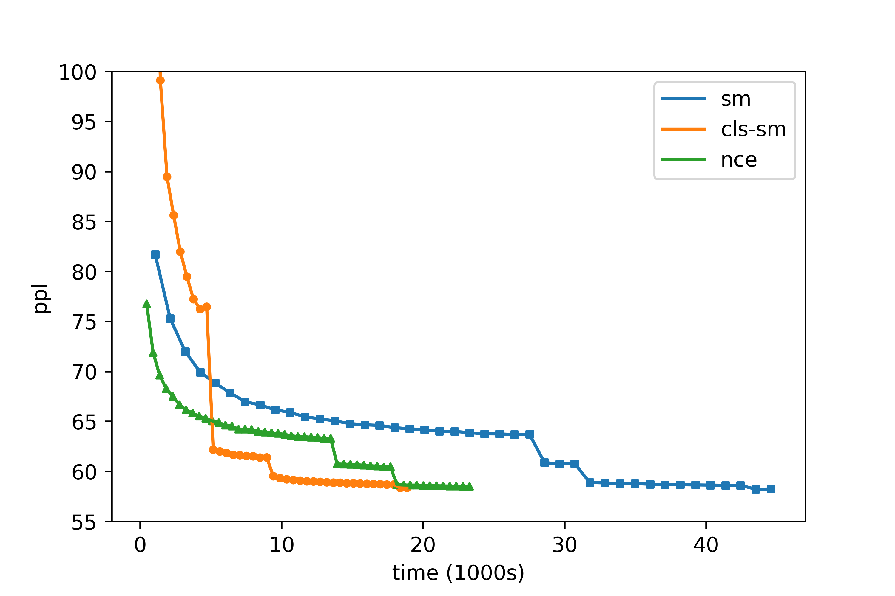

# lstm_language_model

a pytorch version lstm language model, support class-based softmax (Following the [paper](https://arxiv.org/pdf/1602.01576.pdf)) and NCE (noise contrasitve estimation, following the [paper](https://www.cs.toronto.edu/~amnih/papers/ncelm.pdf)], and thanks Stonesjtu's amazing [project](https://github.com/Stonesjtu/Pytorch-NCE)) for speeding up .

## Theoretical Analysis

### Class-based Softmax

In class-based softmax, each word is assigned to one class, hence the probability of a word become:

<a href="https://www.codecogs.com/eqnedit.php?latex=p(w|h)&space;=&space;p(c|h)p(w|c,h)" target="_blank"></a>

Theoretically, the computational cost can be reduced from O(dk) to O(d\sqrt{k}), where d is the size of last hidden layer and k is the size of vocabulary.

But in pratice, there are too many overhead (especially in GPU).

### NCE

NCE transfers the probability estimation problem into a binary classification problem. In NCE, we have a noise distributiona and our goal is to train a model to differentiate the target word from noise. The biggest trick in NCE is that, we treat the probability normalization term as a constant, which saves a lots of time for both training and testing.

## Usage 

Before training the model, please run the following script to build a vocab with class:

```
python build_vocab_with_class.py --ncls 30 --min_count 0
```

The vocab built above is based on the frequence, you can also build your own vocab using other methods. (see example in ./data/penn/vocab.c.txt, Notice that the class should be a integer.)

Run training script:
```
python train.py --cuda --data [data_path] --decoder [sm|nce|cls]
```

## File Structure
 - `data/`: corpus dictionary
 - `params/`: save the parameters
 - `data.py`: custom data iter and dictionary
 - `model.py`: the basic rnn model
 - `decoder.py`: the decoder layers (softmax, class-based softmax and NCE)
 - `train.py`: the training process
 - `utils.py`: utilize functions

## Performance


